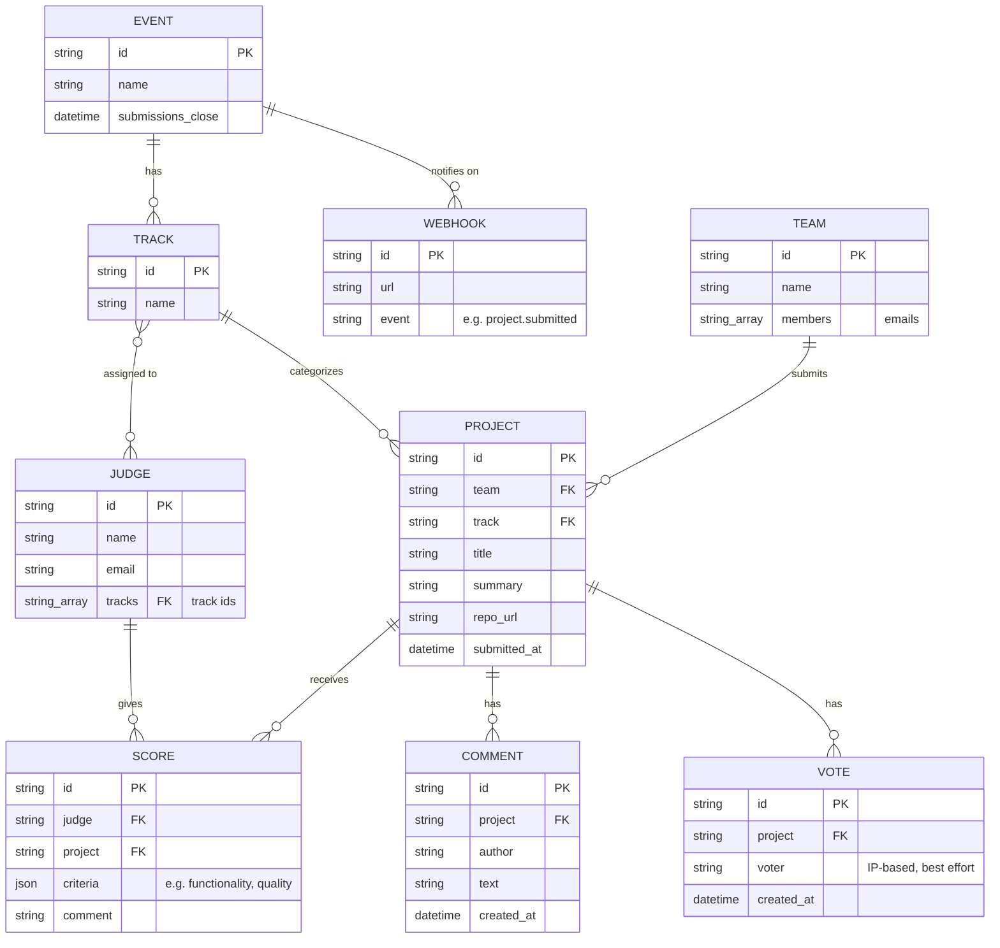

# Entity–Relationship Diagram
## DOGFOOD Portal — Data Model

This diagram covers both the fixture-supplied entities (Event, Track,
Judge, Team, Project, Score — shape fixed by `fixtures.json`, see the
DOGFOOD spec) and the entities this portal adds at runtime (Comment,
Vote, Webhook — see `DATA-MODEL.md` for the full rationale).

## 1. Diagram

## 2. Entity notes

| Entity | Source | Notes |
|--------|--------|-------|
| `EVENT` | `fixtures.json` (`event`) | Singleton per portal instance; `submissions_close` drives all deadline checks (FR-1.4 in `SRS.md`) |
| `TRACK` | `fixtures.json` (`tracks[]`) | A project belongs to at most one track; a judge may be assigned to several |
| `JUDGE` | `fixtures.json` (`judges[]`) | `tracks` is a many-to-many join, modeled as an array of track ids rather than a separate join table (matches the fixture's own shape) |
| `TEAM` | `fixtures.json` (`teams[]`) | `members` is a list of emails, not a foreign key to a `USER` table — this portal has no separate user/account entity, since login itself is out of scope (see `ARCHITECTURE.md`) |
| `PROJECT` | `fixtures.json` (`projects[]`) | Created either at seed time (from the fixture) or at runtime (`POST /projects/new`, `POST /api/import`) — both paths write into the same `projects` map, see `DATA-MODEL.md` |
| `SCORE` | `fixtures.json` (`scores[]`) | `criteria` is intentionally an open JSON object, not a fixed column set — the fixture itself doesn't fix a rubric shape (see `JUDGING.md`) |
| `COMMENT` | Added by this portal (T3) | Public, unauthenticated; not present in `fixtures.json` |
| `VOTE` | Added by this portal (T3) | Public, unauthenticated, deduplicated by IP only (documented limitation) |
| `WEBHOOK` | Added by this portal (T4) | Organizer-registered; recorded, not delivered (no outbound network at runtime) |

## 3. Cardinality summary

- One **Event** has many **Tracks** and (optionally) many registered **Webhooks**.
- One **Track** categorizes many **Projects**, and is assigned to many **Judges** (and a Judge may cover many Tracks) — a genuine many-to-many.
- One **Team** submits one or more **Projects** (the fixture models one project per team in the sample data, but the schema does not enforce a 1:1).
- One **Project** receives many **Scores**, **Comments**, and **Votes**.
- One **Judge** gives many **Scores**, but — enforced by `JudgingService.scoresFor()` (`src/services/JudgingService.js`), not by the schema — may only *read back* the scores where `Score.judge` equals their own id (this is the role-isolation rule from `SRS.md` FR-2.2, not a structural constraint on the data itself).

## 4. Why no separate `USER` entity

The DOGFOOD checker never logs in — it presents a pre-shared header
that resolves directly to a role (`organizer`, `judge_a`/`judge_b`, or
`participant`), as described in `ARCHITECTURE.md`. `JUDGE` already
carries the identity fields (`name`, `email`) a `USER` row would hold
for that role, and `TEAM.members` covers the participant side, so a
generic `USER` table would duplicate data the fixture already gives us
without adding a relationship the checks require.
